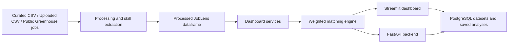
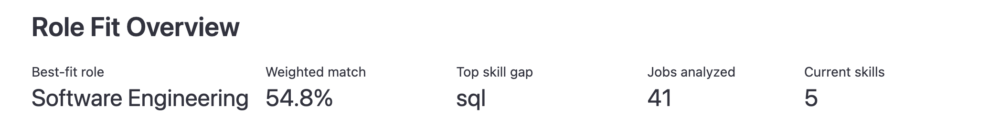
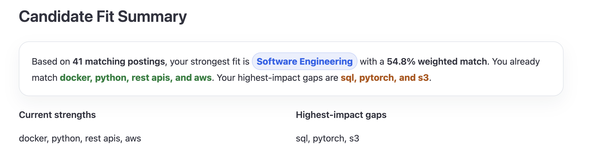
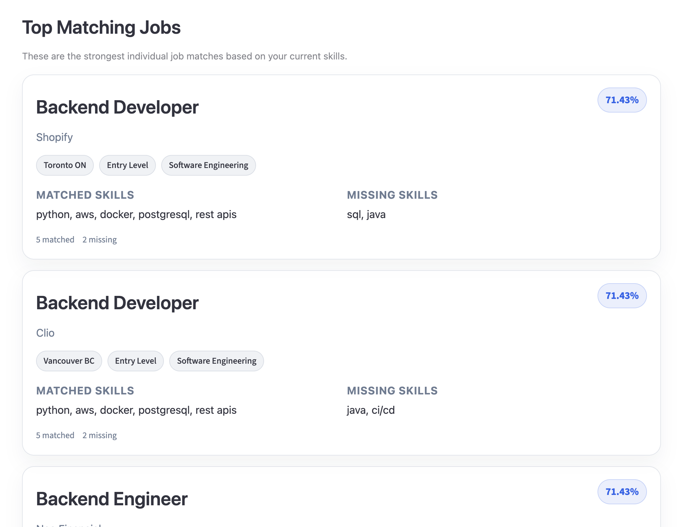
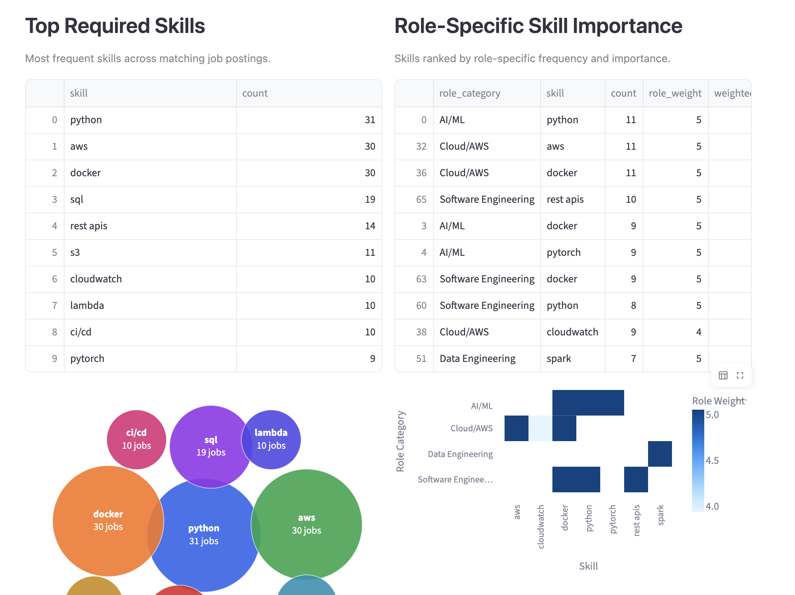

# JobLens AI

[](https://github.com/rpss30/JobLens-AI/actions/workflows/tests.yml)


JobLens AI is a production-style data and AI analytics system for personalized job market intelligence. It turns job postings into explainable role-fit scores, skill-gap recommendations, market insights, and downloadable candidate reports.

The runtime is deterministic and reproducible, while the optional ingestion pipeline can fetch public Greenhouse postings and enrich a curated demo dataset through Groq, Gemini, and deterministic fallback extraction.

## Live Deployments

| Surface | Link | Status |
| --- | --- | --- |
| Streamlit Cloud dashboard | [Open live dashboard](https://joblens-ai-rpss-30.streamlit.app/) | Available; may need to wake after inactivity |
| AWS ECS Fargate dashboard | [Open AWS deployment](http://joblens-alb-134373356.ca-central-1.elb.amazonaws.com/) | Inactive to avoid ongoing AWS charges |
| FastAPI documentation | [Open Swagger UI](http://joblens-alb-134373356.ca-central-1.elb.amazonaws.com/docs) | Inactive to avoid ongoing AWS charges |
| AWS deployment architecture | [View deployment guide](docs/aws-deployment.md) | Available |

The AWS deployment was verified end to end before its runtime resources were
stopped for cost control. It runs Streamlit and FastAPI in one ECS Fargate task
behind an Application Load Balancer, with a private Amazon RDS PostgreSQL
database and credentials stored in AWS Secrets Manager.

## Architecture



The deployed AWS path is:

```text
Amazon ECR image
      |
      v
Application Load Balancer
      |
      +--> Streamlit :8501
      +--> FastAPI   :8000
      |
      v
One ECS Fargate task --> Private RDS PostgreSQL
```

## Demo Preview

### Role Fit Overview



The dashboard summarizes the candidate's best-fit role, weighted match score, top skill gap, number of jobs analyzed, and current skill count.

### Candidate Fit Summary



JobLens AI generates a short natural-language summary explaining the candidate's strongest role fit, existing strengths, and highest-impact missing skills.

### Top Matching Job Cards



The dashboard highlights the strongest individual job matches using card-based job summaries with match score, company, location, role category, matched skills, and missing skills.

### Market Insights



The dashboard also shows market-level insights such as top required skills, role-specific skill importance, jobs by location, top hiring companies, and role distribution.


## Features

- Role-specific skill extraction from job descriptions
- Title-first role categorization with description fallback
- Weighted and unweighted role match scoring
- Skill-gap analysis based on selected candidate skills
- Recommended skills ranked by market demand and role importance
- Candidate fit summary with highlighted strengths and gaps
- Downloadable Markdown and PDF candidate skill-gap reports
- Top matching job cards with job-level evidence
- Jobs-by-location market insight
- Role distribution and top hiring companies
- Interactive Streamlit dashboard with controlled search presets and profile presets
- Optional PostgreSQL-backed data loading with CSV fallback
- Local database seeding script for processed job postings
- Custom CSV upload validation and error handling
- Uploaded CSV datasets can be saved to PostgreSQL
- Uploaded CSV datasets can be named, renamed, and deleted safely
- Saved PostgreSQL datasets can be selected and reloaded from the dashboard
- FastAPI backend with health check and candidate analysis endpoint
- Docker Compose support for running the dashboard, API, and PostgreSQL together
- FastAPI dataset, analysis run, and PostgreSQL-backed analysis support
- Public Greenhouse and Lever ATS normalization support
- Groq-first, Gemini-fallback skill extraction for offline dataset enrichment
- AWS deployment automation for Amazon ECR, ECS Fargate, ALB, Secrets Manager, and RDS PostgreSQL


## Role Categories

JobLens AI currently groups jobs into the following role categories:

- AI/ML
- Data Science
- Data Engineering
- Cloud/AWS
- Software Engineering
- Analytics
- Other


## Data Sources

The repository ships two deterministic demo datasets.

Curated sample postings:

```text
data/raw/sample_jobs.csv
```

The dataset includes approximately 60 job postings across Canadian locations such as:

- Toronto, ON
- Vancouver, BC
- Montreal, QC
- Calgary, AB
- Ottawa, ON

Example roles include:

- Machine Learning Engineer
- AI Engineer
- ML Platform Engineer
- Data Scientist
- Data Analyst
- AWS Cloud Engineer
- Cloud Engineer
- Backend Developer
- Software Engineer
- Data Engineer
- Analytics Engineer

The processed dataset is generated at:

```text
data/processed/processed_jobs.csv
```

Curated, AI-extracted real-job demo:

```text
data/processed/greenhouse_ai_demo_jobs.csv
```

The Greenhouse pipeline fetches public ATS postings, normalizes them into the
JobLens schema, and supports Groq-first extraction with Gemini and deterministic
fallbacks. Large raw fetches and intermediate experiments are generated locally
and excluded from Git; the small curated output is committed so the dashboard
remains stable and reproducible.


## How Matching Works

JobLens AI extracts technical skills from job descriptions using a configurable skill dictionary.

The matching engine calculates two types of scores:

### Unweighted Match Score

Treats every required skill equally.

### Weighted Match Score

Uses role-specific skill weights so that more important skills matter more for each role category.

For example, Python, PyTorch, TensorFlow, model deployment, and MLflow may matter more for AI/ML roles, while AWS, Docker, Terraform, Lambda, and CloudWatch may matter more for Cloud/AWS roles.

This helps avoid the "big pond problem," where a candidate appears to match a role just because they know many minor tools, even if they are missing the most important skills.


## Role-Specific Skill Weighting

Skill weights are generated from the job dataset instead of being manually hardcoded.

For each role category, JobLens AI:

1. Counts how often each skill appears across relevant postings.
2. Converts skill frequency into a role-specific weight.
3. Applies smoothing based on sample size so small categories do not produce unrealistic weights.
4. Uses those weights to calculate weighted candidate fit.

This keeps the scoring system data-driven while still being simple enough to explain in a demo.


## Custom CSV Upload

The dashboard supports uploading a custom job postings CSV.

Required columns:

- `title`
- `company`
- `location`
- `description`
- `experience_level`

Example:

```csv
title,company,location,description,experience_level
Data Scientist,TestCo,Toronto ON,"Analyze data using Python, SQL, Pandas, statistics, dashboards, and scikit-learn.",Entry Level
Cloud Engineer,CloudTest,Vancouver BC,"Build AWS infrastructure using Docker, Terraform, Lambda, S3, EC2, and CloudWatch.",Entry Level
Backend Developer,APITest,Montreal QC,"Build REST APIs using Python, PostgreSQL, Docker, AWS, and CI/CD.",Entry Level
```

A sample upload file is available at:

```text
data/examples/sample_upload_jobs.csv
```

By default, uploaded CSVs are processed during the active Streamlit session. If PostgreSQL is enabled, users can optionally save uploaded CSV datasets to PostgreSQL and reload them later from the dashboard dataset selector.


## Tech Stack

| Layer | Technologies |
| --- | --- |
| Data and matching | Python, Pandas, scikit-learn |
| Dashboard | Streamlit, Altair, Plotly |
| API | FastAPI, Pydantic, Uvicorn |
| Persistence | PostgreSQL, SQLAlchemy, psycopg |
| AI enrichment | Groq, Google Gemini, deterministic fallback |
| Reports | ReportLab, pypdf |
| Infrastructure | Docker, Docker Compose, Amazon ECR, ECS Fargate, ALB, RDS, Secrets Manager, CloudWatch |
| Quality and delivery | pytest, GitHub Actions, Streamlit Cloud |


## Project Structure

```text
JobLens AI
├── assets/screenshots
├── data
│   ├── raw
│   │   └── sample_jobs.csv
│   ├── processed
│   │   ├── processed_jobs.csv
│   │   └── greenhouse_ai_demo_jobs.csv
│   └── examples
│       └── sample_upload_jobs.csv
├── docs
│   └── aws-deployment.md
├── scripts
│   ├── fetch_greenhouse_jobs.py
│   ├── process_greenhouse_jobs_ai_first.py
│   ├── publish_aws_image.sh
│   ├── provision_aws_foundation.sh
│   ├── seed_aws_database.sh
│   └── deploy_aws_service.sh
├── src
│   ├── api
│   │   ├── main.py
│   │   └── schemas.py
│   ├── config
│   │   └── skills.py
│   ├── database
│   │   ├── db.py
│   │   ├── init_db.py
│   │   ├── models.py
│   │   └── repository.py
│   ├── ingestion
│   │   ├── ats_normalizers.py
│   │   ├── greenhouse_client.py
│   │   └── lever_client.py
│   ├── skill_extraction
│   │   ├── extraction_service.py
│   │   ├── gemini_extractor.py
│   │   └── groq_extractor.py
│   ├── processing
│   │   └── job_processor.py
│   ├── matching
│   │   └── match_engine.py
│   └── dashboard
│       ├── app.py
│       ├── charts.py
│       ├── components.py
│       ├── services.py
│       └── styles.py
├── tests
├── .github
│   └── workflows
│       └── tests.yml
├── .streamlit
│   └── config.toml
├── .env.example
├── requirements.txt
└── README.md
```


## Running Locally

Clone the repository:

```bash
git clone https://github.com/rpss30/JobLens-AI.git
cd joblens-ai
```

Create and activate a virtual environment:

```bash
python -m venv venv
source venv/bin/activate
```

Install dependencies:

```bash
pip install -r requirements.txt
```

Run the Streamlit dashboard:

```bash
streamlit run src/dashboard/app.py
```

Run the FastAPI backend:

```bash
uvicorn src.api.main:app --reload
```

Health check:

```bash
curl http://127.0.0.1:8000/health
```

Analyze candidate fit:

```bash
curl -X POST http://127.0.0.1:8000/analyze \
  -H "Content-Type: application/json" \
  -d '{
    "current_skills": ["Python", "SQL", "Pandas"],
    "target_roles": ["Data Scientist"],
    "location": "Any",
    "experience_level": "Entry Level",
    "top_n": 5
  }'
```

List PostgreSQL datasets:

```bash
curl http://127.0.0.1:8000/datasets
```

Analyze a PostgreSQL-backed dataset:

```bash
curl -X POST http://127.0.0.1:8000/analyze \
  -H "Content-Type: application/json" \
  -d '{
    "dataset_name": "sample_jobs",
    "current_skills": ["Python", "SQL", "Pandas"],
    "target_roles": ["Data Scientist"],
    "location": "Any",
    "experience_level": "Entry Level",
    "top_n": 5
  }'
```

### API Endpoints

| Method | Endpoint | Purpose |
| --- | --- | --- |
| `GET` | `/health` | Check API availability |
| `GET` | `/datasets` | List PostgreSQL datasets |
| `PATCH` | `/datasets/{dataset_name}` | Rename an uploaded dataset |
| `DELETE` | `/datasets/{dataset_name}` | Delete an uploaded dataset |
| `GET` | `/analysis-runs` | List saved analysis runs |
| `GET` | `/analysis-runs/{analysis_run_id}` | Load one saved analysis run |
| `POST` | `/analyze` | Run role-fit and skill-gap analysis |

## Running with Docker

JobLens AI can also be run with Docker Compose.

Build and start the Streamlit dashboard, FastAPI backend, and PostgreSQL database:

```bash
docker compose up --build
```

Once the services are running:

- Streamlit dashboard: `http://localhost:8501`
- FastAPI docs: `http://localhost:8000/docs`
- FastAPI health check: `http://localhost:8000/health`

Initialize the PostgreSQL tables:

```bash
docker compose exec dashboard python -m src.database.init_db
```

Seed the sample processed jobs dataset:

```bash
docker compose exec dashboard python -m scripts.seed_database
```

To stop the services:

```bash
docker compose down
```

To stop the services and remove the PostgreSQL volume:

```bash
docker compose down -v
```

## AWS Deployment Path

JobLens AI includes a production-style [AWS deployment guide](docs/aws-deployment.md)
for running the containerized dashboard and API with managed PostgreSQL.

The guide covers Amazon ECR image publishing, Amazon RDS for PostgreSQL,
a cost-conscious Amazon ECS Fargate service running Streamlit and FastAPI,
Application Load Balancer path routing, database initialization, sample dataset
seeding, verification, and teardown.

The repository includes shell helpers for image publishing, AWS foundation
provisioning, database seeding, and repeatable Fargate deployments.

## Local PostgreSQL Setup

JobLens AI can run with either the default processed CSV dataset or a local PostgreSQL database.

The PostgreSQL integration is optional. If the database is unavailable, the Streamlit dashboard falls back to the local processed CSV file.

### 1. Install PostgreSQL

On macOS with Homebrew:

```bash
brew install postgresql@16
brew services start postgresql@16
```

Check that PostgreSQL is available:

```bash
psql --version
```

### 2. Create a local database

```bash
createdb joblens_ai
```

### 3. Configure environment variables

Create a `.env` file in the project root:

```env
DATABASE_URL=postgresql+psycopg://localhost:5432/joblens_ai
```

Do not commit `.env`.

A safe template is included in:

```text
.env.example
```

### 4. Create database tables

```bash
python -m src.database.init_db
```

### 5. Seed the database

Load the existing processed sample jobs into PostgreSQL:

```bash
python -m scripts.seed_database
```

Expected output:

```text
Database tables created successfully.
Seeded <number> processed jobs into PostgreSQL.
```

### 6. Run the dashboard

```bash
streamlit run src/dashboard/app.py
```

In the sidebar, turn on:

```text
Use PostgreSQL database
```

If PostgreSQL is connected and seeded correctly, the sidebar will show a PostgreSQL dataset selector. The default seeded dataset is `sample_jobs`. 

Saved uploaded datasets will also appear in this selector after they are persisted to PostgreSQL.

If PostgreSQL is unavailable, the app falls back to the local processed CSV.

### Database tables

The current PostgreSQL schema includes:

- `datasets`
- `job_postings`
- `processed_jobs`
- `skills`
- `job_skills`
- `analysis_runs`

This supports persistent datasets and analysis history while keeping the core
matching workflow deterministic.

### Saved Analysis Runs

JobLens AI can optionally save completed analysis runs to PostgreSQL.

When PostgreSQL mode is enabled, a user can save an analysis run after generating role-fit results. A saved run stores the key inputs and summary outputs from that analysis, including:

- dataset name
- target roles
- selected location
- selected experience level
- current skills
- best-fit role
- weighted match score
- top missing skill
- jobs analyzed
- recommended skills
- saved role score breakdown

Saved runs can be selected later from the sidebar and previewed in the dashboard. This currently acts as a saved summary view rather than a full automatic rerun of the dashboard filters.

This keeps the feature simple and local-first while demonstrating persistent analysis history with PostgreSQL.

## Testing

Run the test suite locally:

```bash
pytest
```
The project includes tests for dashboard service logic, matching behavior, role-specific weighting, CSV upload validation, and database helper utilities.

Tests are also run automatically through GitHub Actions on pushes and pull requests.


## Current Status

JobLens AI is a portfolio-ready end-to-end system with deterministic analytics,
optional AI-enriched ingestion, persistent PostgreSQL workflows, API access,
containerized local development, and a verified AWS deployment.

Completed:

- Data processing pipeline
- Skill extraction
- Role categorization
- Weighted matching engine
- Recommended skills logic
- Streamlit dashboard
- Search presets
- Candidate profile presets
- Candidate fit summary
- Downloadable Markdown and PDF candidate skill-gap reports
- Top matching job cards
- Jobs-by-location chart
- Role and skill visualizations
- Custom CSV upload with validation
- Dataset naming, rename, and delete controls for uploaded CSV datasets
- PostgreSQL database schema
- PostgreSQL seeding script for processed jobs
- Optional PostgreSQL dashboard loading with CSV fallback
- pytest test suite
- GitHub Actions test workflow
- Streamlit Cloud deployment
- Uploaded CSV persistence to PostgreSQL
- PostgreSQL dataset selector in the dashboard
- Saved analysis runs can be persisted to PostgreSQL and previewed later from the dashboard sidebar.
- FastAPI backend with `/health` and `/analyze` endpoints
- FastAPI endpoints for datasets and saved analysis runs
- Docker Compose setup for Streamlit, FastAPI, and PostgreSQL
- FastAPI can list PostgreSQL datasets and analyze a selected saved dataset
- AWS deployment helpers for ECR, RDS PostgreSQL, ALB, and ECS Fargate
- Public Greenhouse ingestion and curated AI-extracted demo data
- Verified AWS deployment with private RDS, Secrets Manager, ALB, and ECS Fargate

Not built yet:

- Scheduled or continuously running ingestion
- Authentication or multi-user support
- Production-grade NLP role classification
- Infrastructure-as-code deployment automation


## Known Limitations

- The dashboard uses committed demo snapshots rather than fetching live jobs at runtime.
- Greenhouse and Lever ingestion run on demand and are not scheduled.
- Core runtime skill extraction is dictionary-based, so it may miss aliases or uncommon phrasing.
- Role classification is rule-based and title-first, not ML-based yet.
- Match scores are designed for explainability, not as a production hiring recommendation system.
- Dataset management currently supports naming, renaming, and deleting uploaded CSV datasets, but not editing individual job posting rows.
- Saved analysis run loading currently shows a preview only; it does not yet repopulate sidebar filters or automatically rerun the dashboard.
- AWS provisioning is automated with shell helpers, but not yet managed as declarative infrastructure with Terraform, CloudFormation, or CDK.
- The current AWS demo uses an HTTP ALB endpoint without a custom domain or TLS certificate.


## Future Improvements

Planned next steps:

- Schedule ingestion and dataset refresh workflows
- Improve skill alias matching for terms like `JS`, `JavaScript`, `Node`, and `Node.js`
- Add trend analysis for skills by role and location
- Add infrastructure-as-code templates for AWS deployment
- Add authentication and multi-user saved profiles


## Why This Project Matters

JobLens AI demonstrates how a data product can move from ingestion to
explainable analytics and then into a deployed application.

Engineering highlights:

- Building a data pipeline from raw job postings
- Extracting structured skills from unstructured text
- Designing role-specific scoring logic
- Creating an interactive analytics dashboard
- Building persistent dataset-management and saved-analysis workflows
- Exposing the same analysis through a typed FastAPI backend
- Packaging and deploying a multi-process container on AWS ECS Fargate
- Protecting private database credentials with AWS Secrets Manager
- Testing the system with more than 130 automated tests
- Turning raw data into useful product insights
- Communicating technical results in a user-friendly way
