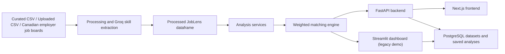
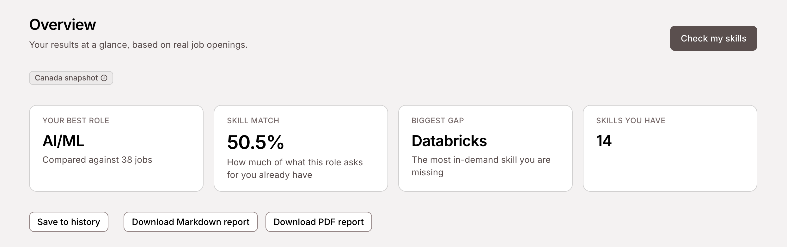
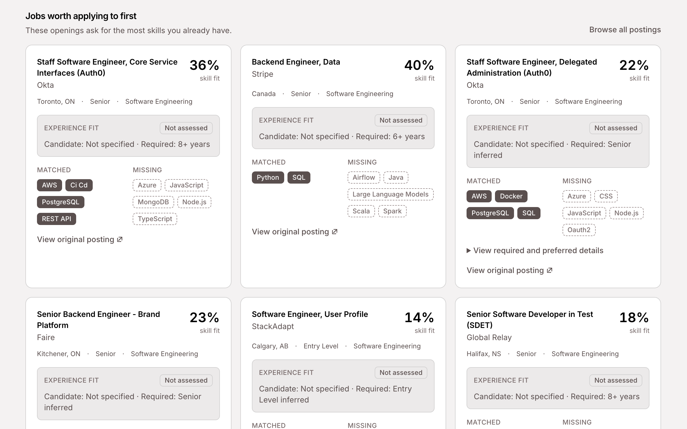
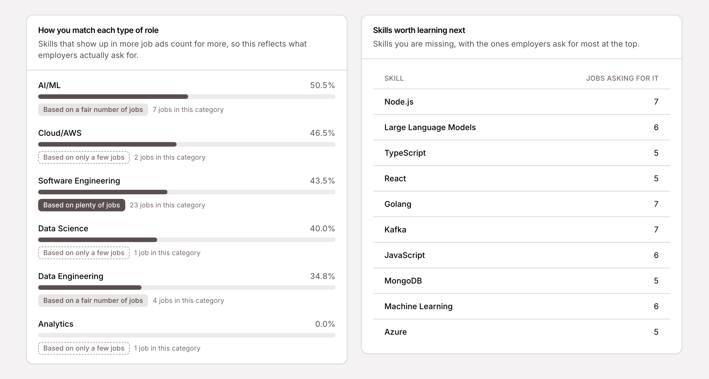

# JobLens AI

[](https://github.com/rpss30/JobLens-AI/actions/workflows/tests.yml)
[](https://github.com/rpss30/JobLens-AI/actions/workflows/security-scan.yml)
[](https://github.com/rpss30/JobLens-AI/actions/workflows/refresh-canada-jobs.yml)


JobLens AI is a production-style data and AI analytics system for personalized job market intelligence. It turns job postings into explainable role-fit scores, skill-gap recommendations, market insights, and downloadable candidate reports.

The web app is a server-rendered Next.js frontend backed by a FastAPI service,
running behind Caddy on a single Linux server with automatic HTTPS. The runtime
is deterministic and reproducible, while the ingestion pipeline collects
first-party Canadian postings from Greenhouse, Lever, and Ashby and uses Groq to
extract skills from complete job descriptions.

## Live Deployments

| Surface | Link | Status |
| --- | --- | --- |
| Next.js app on Lightsail | [Open live app](https://joblens-ai.duckdns.org/) | Available |
| FastAPI documentation on Lightsail | [Open Swagger UI](https://joblens-ai.duckdns.org/api/docs) | Available |
| Streamlit Cloud dashboard | [Open live dashboard](https://joblens-ai-rpss-30.streamlit.app/) | Available; may need to wake after inactivity |
| AWS ECS Fargate dashboard | [Open AWS deployment](http://joblens-alb-134373356.ca-central-1.elb.amazonaws.com/) | Inactive to avoid ongoing AWS charges |
| FastAPI documentation | [Open Swagger UI](http://joblens-alb-134373356.ca-central-1.elb.amazonaws.com/docs) | Inactive to avoid ongoing AWS charges |
| AWS deployment architecture | [View deployment guide](docs/aws-deployment.md) | Available |

The Lightsail deployment is the current production path: one small Linux server
running Caddy, the Next.js frontend, FastAPI, the Django operations portal, and
PostgreSQL under Docker Compose, with a Let's Encrypt certificate and scheduled
backups, monitoring, and log aggregation.

The Streamlit dashboard was the original interface and is kept as a separate
Streamlit Community Cloud demo. It is no longer part of the production stack.

The AWS deployment was verified end to end before its runtime resources were
stopped for cost control. It ran Streamlit and FastAPI in one ECS Fargate task
behind an Application Load Balancer, with a private Amazon RDS PostgreSQL
database and credentials stored in AWS Secrets Manager.

## Architecture


```mermaid
flowchart LR
    A["Curated CSV / Uploaded CSV / Canadian employer job boards"] --> B["Processing and Groq skill extraction"]
    B --> C["Processed JobLens dataframe"]
    C --> D["Analysis services"]
    D --> E["Weighted matching engine"]
    E --> G["FastAPI backend"]
    G --> I["Next.js frontend"]
    G --> H["PostgreSQL datasets and saved analyses"]
    E --> F["Streamlit dashboard (legacy demo)"]
    F --> H
```

The browser only ever talks to the Next.js server. Pages fetch through Server
Components and Server Actions, and the few client-side calls post to thin route
handlers under `/proxy/*`, so the FastAPI origin stays server-side and needs no
CORS allowlist for the app itself.

The deployed single-server path is:

```text
Let's Encrypt
      |
      v
Caddy :80/:443  (one domain, one certificate)
      |
      +--> /          --> Next.js       :3000
      +--> /api/*     --> FastAPI       :8000
      +--> /ops/*     --> Django ops    :8001
      |
      v
Private Docker network --> PostgreSQL :5432
```

Only Caddy publishes host ports. The application services use `expose`, so
PostgreSQL, FastAPI, Django, and the Next.js server are unreachable from the
public internet.

The earlier AWS path was:

```text
Amazon ECR image
      |
      v
Application Load Balancer
      |
      +--> Streamlit :8501
      +--> FastAPI   :8000
      |
      v
One ECS Fargate task --> Private RDS PostgreSQL
```

## Demo Preview

Screens from the Next.js app. The sidebar carries Overview, Analyze, Jobs,
Skills & Market, History, and Datasets, with a dataset switcher and a live
backend status indicator in the header.

### Role Fit Overview



The overview section summarizes the candidate's best-fit role, role skill fit, sample confidence, top skill gap, number of jobs analyzed, and current skill count.

### Top Matching Job Cards



The strongest individual job matches appear as cards with match score, company, location, role category, matched skills, and missing skills.

### Market Insights



The Skills & Market section  shows market-level insights such as top required skills, role-specific skill importance, jobs by location, top hiring companies, and role distribution.


## Features

- Role-specific skill extraction from job descriptions
- Title-first role categorization with description fallback
- Representative job-level role fit with weighted and unweighted scoring
- TF-IDF character similarity for related skill names and formatting variants
- Sample-confidence protection for role categories with limited postings
- Skill-gap analysis based on selected candidate skills
- Recommended skills ranked by market demand and role importance
- Candidate fit summary with highlighted strengths and gaps
- Privacy-conscious resume text analysis with extracted skills, fit score, gaps, and job-level explanations
- Downloadable Markdown and PDF candidate skill-gap reports
- Top matching job cards with job-level evidence
- Jobs-by-location market insight
- Role distribution and top hiring companies
- Next.js frontend with overview, analysis, job browsing, market insights, history, and dataset management
- Server-rendered pages that consume the FastAPI backend without duplicating business logic, so the API origin never reaches the browser
- Saved analysis history with per-run rename and delete controls
- Markdown and PDF candidate report downloads from the API and both frontends
- Original Streamlit dashboard retained as a standalone demo with search and profile presets
- Free-text TF-IDF job search across titles, skills, employers, locations, and descriptions
- Optional semantic and hybrid search modes using local deterministic SVD embeddings
- Optional PostgreSQL-backed data loading with CSV fallback
- Local database seeding script for processed job postings
- Custom CSV upload validation with extension, size, row-count, and schema checks
- Uploaded CSV datasets can be saved to PostgreSQL
- Uploaded CSV datasets can be named, renamed, and deleted from the datasets page
- Saved PostgreSQL datasets can be selected from the header dataset switcher on any page
- FastAPI backend with health check, candidate analysis, CORS allowlist, safe errors, and rate limiting
- Docker Compose support for local development and a production-style single-server stack
- FastAPI dataset, analysis run, and PostgreSQL-backed analysis support
- First-party Greenhouse, Lever, Ashby, and JSON-LD ingestion support
- Canada-only location normalization, deduplication, and balanced snapshots
- Groq skill extraction from complete first-party job descriptions
- Structured skill extraction with prompt versioning, confidence metadata, and offline evaluation cases
- JSON/Markdown ingestion run summaries with refresh metrics and failure logs
- Weekly Canada snapshot refreshes with automated quality gates and reviewable pull requests
- AWS deployment automation for Amazon ECR, ECS Fargate, ALB, Secrets Manager, and RDS PostgreSQL
- Opt-in off-server database backup upload checks and webhook alert delivery for production monitoring
- Read-only Parameter Store env rendering for production secrets with local audit integration


## Role Categories

JobLens AI currently groups jobs into the following role categories:

- AI/ML
- Data Science
- Data Engineering
- Cloud/AWS
- Software Engineering
- Analytics
- Other


## Data Sources

The repository ships two deterministic demo datasets.

Curated sample postings:

```text
data/raw/sample_jobs.csv
```

The dataset includes approximately 60 job postings across Canadian locations such as:

- Toronto, ON
- Vancouver, BC
- Montreal, QC
- Calgary, AB
- Ottawa, ON

Example roles include:

- Machine Learning Engineer
- AI Engineer
- ML Platform Engineer
- Data Scientist
- Data Analyst
- AWS Cloud Engineer
- Cloud Engineer
- Backend Developer
- Software Engineer
- Data Engineer
- Analytics Engineer

The processed dataset is generated at:

```text
data/processed/processed_jobs.csv
```

Curated Canada-wide real-job snapshot:

```text
data/processed/canada_jobs_snapshot.csv
```

The snapshot contains a balanced set of up to 72 active postings across
normalized Canadian location labels. It combines first-party Greenhouse, Lever,
and Ashby boards, preserves original application links, and uses Groq for
packaged skill extraction. The raw multi-employer fetch is generated outside
Git; the validated processed snapshot is committed so the app remains
stable and reproducible.

A GitHub Actions workflow refreshes the snapshot weekly, runs quality checks
and the full test suite, and opens a pull request when the dataset changes.
This keeps data updates reviewable rather than modifying `main` automatically.

The Canada jobs snapshot is the app's default dataset. The bundled sample
dataset remains available in the dataset chooser and is used as a safety
fallback if the committed Canada snapshot cannot be loaded.


## How Matching Works

JobLens AI extracts technical skills from job descriptions using a configurable skill dictionary.

The matching engine scores each job posting independently, then summarizes the
top quartile of representative opportunities for each role category. This
avoids treating every technology mentioned across an entire category as one
impossible combined job requirement.

The engine calculates two types of scores:

### Unweighted Match Score

Treats every required skill equally.

### Role Skill Fit

Uses role-specific skill weights so that more important skills matter more for each role category.

For example, Python, PyTorch, TensorFlow, model deployment, and MLflow may matter more for AI/ML roles, while AWS, Docker, Terraform, Lambda, and CloudWatch may matter more for Cloud/AWS roles.

Character n-gram TF-IDF also recognizes conservative related-skill evidence,
such as formatting variants and compound skill names, while exact matches still
receive full credit. Categories backed by only one or two postings remain
visible but are marked as limited-confidence and cannot displace a category with
a representative sample in the headline result.

Free-text job search is calculated separately from candidate skill fit. The
default TF-IDF mode ranks postings across titles, extracted skills, role
categories, employers, locations, and descriptions. Semantic mode uses local
SVD embeddings over the same job documents to support conceptual queries, and
hybrid mode blends lexical and semantic relevance. Structured role, location,
and experience filters can further narrow that relevant posting set before the
matching engine calculates role fit and skill gaps.

Resume analysis is optional. Pasted resume text is analyzed in memory, converted
into extracted skills and experience signals, and combined with manually selected
skills for role-fit scoring. Raw resume text is not saved to PostgreSQL, returned
by the API, or stored in saved analysis runs.


## Role-Specific Skill Weighting

Skill weights are generated from the job dataset instead of being manually hardcoded.

For each role category, JobLens AI:

1. Builds role documents from skills observed in individual postings.
2. Uses TF-IDF to estimate role-specific skill importance.
3. Scores every posting against the candidate's exact and related skills.
4. Aggregates the strongest representative quartile for each role category.
5. Calculates a smooth confidence score from the available role sample.

This keeps the scoring system data-driven while still being simple enough to explain in a demo.


## Custom CSV Upload

The datasets page supports uploading a custom job postings CSV.

Required columns:

- `title`
- `company`
- `location`
- `description`
- `experience_level`

Example:

```csv
title,company,location,description,experience_level
Data Scientist,TestCo,Toronto ON,"Analyze data using Python, SQL, Pandas, statistics, dashboards, and scikit-learn.",Entry Level
Cloud Engineer,CloudTest,Vancouver BC,"Build AWS infrastructure using Docker, Terraform, Lambda, S3, EC2, and CloudWatch.",Entry Level
Backend Developer,APITest,Montreal QC,"Build REST APIs using Python, PostgreSQL, Docker, AWS, and CI/CD.",Entry Level
```

A sample upload file is available at:

```text
data/examples/sample_upload_jobs.csv
```

Uploads are saved to PostgreSQL under a required custom name and stay available
from the header dataset switcher on every page. Upload, rename, and delete run as
Server Actions, so the rendered list updates without a manual reload, and delete
asks for confirmation first. Curated sample datasets remain protected.

In the legacy Streamlit dashboard, uploads are processed for the active session
and persisted only when PostgreSQL is enabled.


## Tech Stack

| Layer | Technologies |
| --- | --- |
| Frontend | Next.js 16, React 19, TypeScript, Tailwind CSS, Recharts |
| Data and matching | Python, Pandas, scikit-learn |
| API | FastAPI, Pydantic, Uvicorn, Gunicorn |
| Legacy dashboard | Streamlit, Altair, Plotly |
| Ops tooling | Django, Django templates, Gunicorn |
| Persistence | PostgreSQL, SQLAlchemy, Alembic, psycopg |
| AI enrichment | Groq, Google Gemini, deterministic fallback |
| Reports | ReportLab, pypdf |
| Infrastructure | Docker, Docker Compose, Caddy, Terraform templates, Amazon ECR, ECS Fargate, ALB, RDS, Secrets Manager, CloudWatch |
| Quality and delivery | pytest, GitHub Actions, deployment scripts, Amazon Lightsail, Streamlit Cloud |
| Security checks | pip-audit, Bandit, Trivy |


## Project Structure

```text
JobLens AI
├── alembic
│   └── versions
├── assets/screenshots
├── data
│   ├── raw
│   │   └── sample_jobs.csv
│   ├── processed
│   │   ├── processed_jobs.csv
│   │   └── canada_jobs_snapshot.csv
│   ├── sources
│   │   └── canada_employers.json
│   └── examples
│       └── sample_upload_jobs.csv
├── docs
│   ├── ai-extraction.md
│   ├── database.md
│   ├── database-backups.md
│   ├── django-ops.md
│   ├── external-uptime-monitoring.md
│   ├── log-aggregation.md
│   ├── lightsail-deployment-plan.md
│   ├── offsite-backups-alerts.md
│   ├── operations-monitoring.md
│   ├── parameter-store-secrets.md
│   ├── production-ingestion.md
│   ├── production-compose.md
│   ├── production-deployment.md
│   ├── production-readiness.md
│   ├── resume-analysis.md
│   ├── semantic-search.md
│   ├── secret-rotation.md
│   ├── security-scanning.md
│   ├── server-hardening.md
│   ├── security.md
│   ├── testing.md
│   └── aws-deployment.md
├── deploy
│   ├── caddy
│   ├── lightsail
│   │   └── terraform
│   ├── scripts
│   └── server
│       └── systemd
├── frontend
│   ├── src
│   │   ├── app
│   │   ├── components
│   │   ├── context
│   │   └── lib
│   ├── Dockerfile
│   └── README.md
├── scripts
│   ├── fetch_greenhouse_jobs.py
│   ├── fetch_canada_jobs.py
│   ├── build_canada_jobs_snapshot.py
│   ├── validate_canada_jobs_snapshot.py
│   ├── process_greenhouse_jobs_ai_first.py
│   ├── publish_aws_image.sh
│   ├── provision_aws_foundation.sh
│   ├── seed_aws_database.sh
│   └── deploy_aws_service.sh
├── src
│   ├── api
│   │   ├── routers
│   │   ├── services
│   │   ├── application.py
│   │   ├── main.py
│   │   └── schemas.py
│   ├── config
│   │   └── skills.py
│   ├── database
│   │   ├── db.py
│   │   ├── init_db.py
│   │   ├── models.py
│   │   └── repository.py
│   ├── ingestion
│   │   ├── ats_normalizers.py
│   │   ├── greenhouse_client.py
│   │   ├── pipeline_runs.py
│   │   └── lever_client.py
│   ├── skill_extraction
│   │   ├── evaluation.py
│   │   ├── extraction_service.py
│   │   ├── gemini_extractor.py
│   │   ├── groq_extractor.py
│   │   └── schema.py
│   ├── processing
│   │   └── job_processor.py
│   ├── resume
│   │   └── resume_analyzer.py
│   ├── matching
│   │   └── match_engine.py
│   ├── search
│   │   └── semantic_search.py
│   └── dashboard
│       ├── app.py
│       ├── charts.py
│       ├── components.py
│       ├── services.py
│       └── styles.py
├── tests
├── .github
│   └── workflows
│       └── tests.yml
├── .streamlit
│   └── config.toml
├── .env.example
├── requirements.txt
└── README.md
```


## Running Locally

Clone the repository:

```bash
git clone https://github.com/rpss30/JobLens-AI.git
cd joblens-ai
```

Create and activate a virtual environment:

```bash
python -m venv venv
source venv/bin/activate
```

Install dependencies:

```bash
pip install -r requirements.txt
```

Run the FastAPI backend:

```bash
uvicorn src.api.main:app --reload
```

Then run the Next.js frontend in a second terminal, which needs that backend up:

```bash
cd frontend && npm install && npm run dev
```

The app is served at `http://localhost:3000`. See
[frontend/README.md](frontend/README.md) for its architecture, routes, and
environment variables. Copy `frontend/.env.example` to `frontend/.env.local` to
point at a backend on a non-default port.

The original Streamlit dashboard still runs standalone if you want to compare
the two interfaces:

```bash
streamlit run src/dashboard/app.py
```

Health check:

```bash
curl http://127.0.0.1:8000/health
```

Analyze candidate fit:

```bash
curl -X POST http://127.0.0.1:8000/analyze \
  -H "Content-Type: application/json" \
  -d '{
    "current_skills": ["Python", "SQL", "Pandas"],
    "resume_text": "",
    "search_query": "data scientist experimentation",
    "target_roles": [],
    "location": "Any",
    "experience_level": "Any",
    "top_n": 5
  }'
```

List PostgreSQL datasets:

```bash
curl http://127.0.0.1:8000/datasets
```

Analyze a PostgreSQL-backed dataset:

```bash
curl -X POST http://127.0.0.1:8000/analyze \
  -H "Content-Type: application/json" \
  -d '{
    "dataset_name": "sample_jobs",
    "current_skills": ["Python", "SQL", "Pandas"],
    "target_roles": ["Data Scientist"],
    "location": "Any",
    "experience_level": "Entry Level",
    "top_n": 5
  }'
```

### App Pages

| Route | Purpose | Backing endpoint |
| --- | --- | --- |
| `/` | Role fit, skill gaps, and top matches for the current analysis | `POST /analyze` |
| `/analyze` | Profile builder and search scope | `GET /filter-options`, `POST /analyze` |
| `/jobs` | Browse and filter every posting | `GET /jobs` |
| `/skills` | Skill demand, role importance, location and employer concentration | `POST /market-insights` |
| `/history` | Saved analysis runs | `GET /analysis-runs` |
| `/history/[id]` | One saved run | `GET /analysis-runs/{id}` |
| `/datasets` | Upload a jobs CSV, rename or delete saved datasets | `GET`, `POST`, `PATCH`, `DELETE /datasets` |

### API Endpoints

| Method | Endpoint | Purpose |
| --- | --- | --- |
| `GET` | `/health` | Check API availability |
| `GET` | `/datasets` | List PostgreSQL datasets |
| `POST` | `/datasets` | Upload a jobs CSV as a new dataset |
| `PATCH` | `/datasets/{dataset_name}` | Rename an uploaded dataset |
| `DELETE` | `/datasets/{dataset_name}` | Delete an uploaded dataset |
| `GET` | `/analysis-runs` | List saved analysis runs |
| `POST` | `/analysis-runs` | Save an analysis run |
| `GET` | `/analysis-runs/{analysis_run_id}` | Load one saved analysis run |
| `GET` | `/filter-options` | List selectable analysis filters and dataset summary |
| `GET` | `/jobs` | Browse job postings with search, sorting, and pagination |
| `POST` | `/market-insights` | Summarize skill, location, and employer demand |
| `POST` | `/reports/candidate` | Download a Markdown or PDF skill-gap report |
| `POST` | `/analyze` | Search jobs and run role-fit and skill-gap analysis |

List endpoints support bounded pagination with `limit` and `offset`, plus
`sort_by` and `sort_order`. `/datasets` can also filter by `source_type`, and
`/analysis-runs` can filter by `dataset_name`.

## Running with Docker

JobLens AI can also be run locally with Docker Compose.

Build and start the Next.js frontend, FastAPI backend, Django operations service,
Streamlit dashboard, and PostgreSQL database:

```bash
docker compose up --build
```

Once the services are running:

- Next.js app: `http://localhost:3000`
- FastAPI docs: `http://localhost:8000/docs`
- FastAPI health check: `http://localhost:8000/health`
- Django operations service: `http://localhost:8001/ops/`
- Django health check: `http://localhost:8001/health/`
- Streamlit dashboard: `http://localhost:8501`

Initialize the PostgreSQL tables:

```bash
docker compose exec api alembic upgrade head
```

Seed the sample processed jobs dataset:

```bash
docker compose exec api python -m scripts.seed_database
```

Initialize Django-owned auth and session tables:

```bash
docker compose exec django-ops python -m django_ops.manage migrate
```

Create a local staff user for the Django operations routes:

```bash
docker compose exec django-ops python -m django_ops.manage createsuperuser
```

Create the operations access groups:

```bash
docker compose exec django-ops python -m django_ops.manage bootstrap_ops_roles
```

Assign the staff user to `JobLens Ops Viewers` for read access or
`JobLens Ops Managers` for future state-changing operations.

To stop the services:

```bash
docker compose down
```

To stop the services and remove the PostgreSQL volume:

```bash
docker compose down -v
```

For the production-style single-server Compose stack, use
[`docker-compose.prod.yml`](docker-compose.prod.yml) with a private PostgreSQL
network, Caddy HTTPS routing, app health checks, persistent database storage,
and no public database port:

```bash
cp .env.production.example .env.production
docker compose --env-file .env.production -f docker-compose.prod.yml config -q
```

Caddy serves the Next.js frontend at `/`, FastAPI at `/api/*`, and the Django
operations portal at `/ops/*` under one domain and one certificate. The frontend
reaches FastAPI over the internal Docker network, so the API needs no public
hostname of its own. The Streamlit dashboard is not part of this stack; it stays
in the repository and on Streamlit Community Cloud as a separate deployment.

See [docs/production-compose.md](docs/production-compose.md) for startup,
migration order, routing, health checks, and current limits. The production
Compose file publishes only Caddy on ports 80 and 443 and does not provision
cloud resources.

See [docs/server-hardening.md](docs/server-hardening.md) for the host firewall,
SSH, deployment-user, unattended-update, and Docker log-rotation runbook.

See [docs/production-deployment.md](docs/production-deployment.md) for the
manual GitHub Actions deployment workflow, SSH-based server update script,
ordered Alembic and Django migrations, public health checks, and rollback
procedure.

See [docs/database-backups.md](docs/database-backups.md) for PostgreSQL
`pg_dump` backups, local retention, restore validation, backup status checks,
and gated restore procedures.

See [docs/offsite-backups-alerts.md](docs/offsite-backups-alerts.md) for the
optional off-server backup copy and webhook alerting workflow.

See [docs/operations-monitoring.md](docs/operations-monitoring.md) for local
service health, backup freshness, off-server backup checks, disk usage, alert
delivery, log snapshots, and local log aggregation on the single-server
production path.

See [docs/production-ingestion.md](docs/production-ingestion.md) for the
weekly server-side Canada jobs refresh timer, ingestion status file, PostgreSQL
dataset publishing flow, and failure triage.

See [docs/secret-rotation.md](docs/secret-rotation.md) for production runtime
secret inventory, `.env.production` auditing, planned rotation, deployment SSH
key rotation, staged provider key promotion, and emergency replacement steps.

See [docs/parameter-store-secrets.md](docs/parameter-store-secrets.md) for
rendering `.env.production` from an existing Parameter Store path with key-name
only status output.

See [docs/production-readiness.md](docs/production-readiness.md) for the
preflight checklist that ties together cost guardrails, server readiness,
secret audit, backups, deployment, monitoring, and post-deploy verification.

See [docs/lightsail-deployment-plan.md](docs/lightsail-deployment-plan.md) for
the plan-only Lightsail resource inventory, current cost estimate, approval
gate, Terraform template, and teardown checklist for the low-cost single-server
target.

## Django Operations Service

JobLens includes a Django operations service for authenticated internal
pipeline visibility and reviewed operations workflows. FastAPI remains the
typed candidate-analysis API, while Django owns staff authentication,
role-based operations access, investigation pages, and audited state-changing
operations.

The Django service currently provides:

- PostgreSQL configuration through `DATABASE_URL`
- unmanaged Django models for Alembic-owned pipeline tables
- a database-backed `/health/` endpoint
- dedicated `/ops/login/` and `/ops/logout/` routes
- a staff-only `/ops/` route protected by operations groups
- `/ops/runs/` with filters and pagination for persisted pipeline runs
- `/ops/runs/<run_id>/` run details with metadata, source results, and linked extraction issues
- `/ops/extractions/issues/` for empty or failed skill extraction attempts joined to postings
- manager-only extraction review notes, reviewed status, retry requests, and audit events
- Docker Compose support through Gunicorn

Alembic owns the existing JobLens application tables. Django owns its framework
tables plus operations-only review and audit tables. See
[docs/django-ops.md](docs/django-ops.md) for local startup, route coverage,
migration ownership, deployment ordering, and current limitations.

## AWS Deployment Path

Alongside the single-server path above, JobLens AI includes a production-style
[AWS deployment guide](docs/aws-deployment.md) for running the containerized app
and API with managed PostgreSQL. It documents a heavier, more scalable shape than
the Lightsail deployment currently serving the live site.

The guide covers Amazon ECR image publishing, Amazon RDS for PostgreSQL,
a cost-conscious Amazon ECS Fargate service running Streamlit and FastAPI,
Application Load Balancer path routing, database initialization, sample dataset
seeding, verification, and teardown.

The repository includes shell helpers for image publishing, AWS foundation
provisioning, database seeding, and repeatable Fargate deployments.

## Local PostgreSQL Setup

JobLens AI can run with the default Canada jobs snapshot, the bundled sample
dataset, an uploaded session CSV, or a local PostgreSQL dataset.

The PostgreSQL integration is optional. If the database is unavailable, the app
falls back to the bundled datasets and the header status indicator turns red;
uploads and saved analysis history are the only features that need the database.

### 1. Install PostgreSQL

On macOS with Homebrew:

```bash
brew install postgresql@16
brew services start postgresql@16
```

Check that PostgreSQL is available:

```bash
psql --version
```

### 2. Create a local database

```bash
createdb joblens_ai
```

### 3. Configure environment variables

Create a `.env` file in the project root:

```env
DATABASE_URL=postgresql+psycopg://localhost:5432/joblens_ai
JOBLENS_CORS_ORIGINS=http://localhost:3000,http://localhost:8501
JOBLENS_RATE_LIMIT_ENABLED=true
JOBLENS_ANALYZE_RATE_LIMIT=60
JOBLENS_RATE_LIMIT_WINDOW_SECONDS=60
```

Do not commit `.env`.

A safe template is included in:

```text
.env.example
```

### 4. Create database tables

```bash
alembic upgrade head
```

If you have an existing local database that was created before Alembic was
added, either recreate the local database or stamp the old baseline first:

```bash
alembic stamp 202607010001
alembic upgrade head
```

### 5. Seed the database

Load the existing processed sample jobs into PostgreSQL:

```bash
python -m scripts.seed_database
```

Expected output:

```text
Seeded <number> processed jobs into PostgreSQL.
```

### 6. Run the app

```bash
uvicorn src.api.main:app --reload
```

```bash
cd frontend && npm run dev
```

If PostgreSQL is connected and seeded correctly, the header dataset switcher
lists the seeded datasets under "PostgreSQL datasets" alongside the bundled ones.
The default seeded dataset is `sample_jobs`, and uploads from the datasets page
appear there once persisted.

If PostgreSQL is unavailable, the switcher shows only the bundled datasets and
the status indicator beside it turns red.

The legacy Streamlit dashboard reads the same database, with a
"Use PostgreSQL database" toggle in its sidebar:

```bash
streamlit run src/dashboard/app.py
```

### Database tables

The current PostgreSQL schema includes:

- `datasets`
- `job_postings`
- `processed_jobs`
- `skills`
- `job_skills`
- `analysis_runs`
- `ingestion_runs`
- `extraction_results`

This supports persistent datasets, analysis history, pipeline run tracking, and
AI extraction provenance while keeping the core matching workflow deterministic.
See [docs/database.md](docs/database.md) for migration commands, indexes,
constraints, and `EXPLAIN ANALYZE` examples.

### Saved Analysis Runs

JobLens AI can optionally save completed analysis runs to PostgreSQL.

When PostgreSQL mode is enabled, a user can save an analysis run after generating role-fit results. A saved run stores the key inputs and summary outputs from that analysis, including:

- dataset name
- target roles
- selected location
- selected experience level
- current skills
- best-fit role
- role skill fit score
- representative posting count and sample confidence
- top missing skill
- jobs analyzed
- recommended skills
- saved role score breakdown

Saved runs are listed on the history page, where each one can be opened, renamed, or deleted. Opening a run renders its stored result rather than re-running the search, so history stays a record of what was analyzed at the time.

This keeps the feature simple and local-first while demonstrating persistent analysis history with PostgreSQL.

## Testing

Run the test suite locally:

```bash
pytest
```
The project includes tests for dashboard service logic, matching behavior, role-specific weighting, CSV upload validation, API security controls, and database helper utilities.

Tests are also run automatically through GitHub Actions on pushes and pull requests.

Run coverage locally:

```bash
pytest --cov=src --cov-report=term-missing --cov-report=xml
```

See [docs/testing.md](docs/testing.md) for the test strategy, fixture design,
reliability regression coverage, and CI behavior.

See [docs/security-scanning.md](docs/security-scanning.md) for dependency,
static Python, and container image scan commands, CI behavior, and report
handling.

See [docs/external-uptime-monitoring.md](docs/external-uptime-monitoring.md)
for scheduled public health checks, uptime reports, and webhook alert delivery.

See [docs/log-aggregation.md](docs/log-aggregation.md) for server-local JSONL
log aggregation, freshness checks, retention, and timer installation.

Run the offline skill extraction evaluation:

```bash
python scripts/evaluate_skill_extraction.py --minimum-average-recall 0.85
```

See [docs/ai-extraction.md](docs/ai-extraction.md) for the structured output
contract, fallback behavior, extraction metadata, and evaluation strategy.

See [docs/semantic-search.md](docs/semantic-search.md) for the local semantic
search design, hybrid scoring behavior, and `pgvector` tradeoff.

See [docs/resume-analysis.md](docs/resume-analysis.md) for resume matching
behavior, API usage, privacy boundaries, and tradeoffs.

See [docs/security.md](docs/security.md) for CORS, rate limiting, upload
validation, resume privacy, secret handling, and AWS hardening notes.


## Current Status

JobLens AI is a portfolio-ready end-to-end system with deterministic analytics,
optional AI-enriched ingestion, persistent PostgreSQL workflows, API access,
containerized local development, and a live single-server deployment with
automatic HTTPS.

Completed:

- Next.js frontend with server-rendered pages, a dataset switcher, and saved analysis history
- Live Amazon Lightsail deployment behind Caddy with a Let's Encrypt certificate

- Data processing pipeline
- Skill extraction
- Role categorization
- Weighted matching engine
- Recommended skills logic
- Streamlit dashboard, the original interface, now a standalone demo
- Search presets
- Candidate profile presets
- Candidate fit summary
- Downloadable Markdown and PDF candidate skill-gap reports
- Top matching job cards
- Jobs-by-location chart
- Role and skill visualizations
- Custom CSV upload with validation
- Dataset naming plus layered rename and delete controls for uploaded CSV datasets
- PostgreSQL database schema
- Alembic-managed database migrations
- PostgreSQL seeding script for processed jobs
- Optional PostgreSQL dataset loading with CSV fallback
- pytest test suite
- CI coverage reporting for the source package
- GitHub Actions test workflow
- Weekly GitHub Actions Canada snapshot refresh workflow
- Canada refresh pipeline metrics and failure summaries
- Streamlit Cloud deployment
- Uploaded CSV persistence to PostgreSQL
- PostgreSQL dataset switcher available on every page
- Saved analysis runs can be persisted to PostgreSQL, then listed, opened, renamed, and deleted from the history page
- FastAPI backend with `/health` and `/analyze` endpoints
- FastAPI endpoints for datasets and saved analysis runs
- FastAPI CORS allowlist, request limits, safe exception responses, and `/analyze` rate limiting
- Docker Compose setup for the Next.js frontend, FastAPI, Streamlit, and PostgreSQL
- Production Compose stack with Caddy HTTPS routing and internal PostgreSQL networking
- Server hardening runbook for host firewall, SSH, deployment user, and Docker log rotation
- Manual production deployment workflow with SSH, migration ordering, health checks, and rollback
- Local PostgreSQL backup scripts with retention, restore validation, backup freshness checks, and a daily systemd timer template
- Optional off-server database backup copies to an existing S3 URI with freshness checks and cost guardrails
- Local operations monitoring scripts for Compose service health, public health checks, backup freshness, off-server backup checks, disk usage, alert delivery, log snapshots, and central JSONL log aggregation
- Weekly production ingestion scheduler that refreshes, validates, and publishes the Canada jobs dataset into PostgreSQL
- Production secret audit script and rotation runbook for `.env.production`, provider keys, Django, PostgreSQL, and deployment SSH keys
- Staged provider key rotation helper with dry-run, backup, promotion, and audit status output
- Read-only Parameter Store `.env.production` rendering with post-render secret auditing
- Dependency, static Python, and container image security scanning in CI
- Scheduled external uptime checks for public health, API, and operations routes
- Server-local central log aggregation with freshness checks and systemd timer templates
- Production readiness checker and rollout checklist for the single-server deployment path
- Lightsail deployment plan with cost estimate, resource inventory template, Terraform scaffold, approval gate, and teardown checklist
- FastAPI can list PostgreSQL datasets and analyze a selected saved dataset
- AWS deployment helpers for ECR, RDS PostgreSQL, ALB, and ECS Fargate
- Multi-employer Canadian ingestion and a curated Groq-enriched snapshot
- Structured AI skill extraction contract and offline quality evaluation
- Semantic and hybrid job search modes with local deterministic embeddings
- Privacy-conscious paste-in resume analysis with API and dashboard support
- Upload security controls and safe database error messages
- Verified AWS deployment with private RDS, Secrets Manager, ALB, and ECS Fargate

Not built yet:

- Authentication or multi-user support
- Production-grade NLP role classification
- Applied infrastructure-as-code deployment


## Known Limitations

- JobLens serves a weekly committed snapshot rather than fetching live jobs at runtime.
- Core runtime skill extraction is dictionary-based, so it may miss aliases or uncommon phrasing.
- Role classification is rule-based and title-first, not ML-based yet.
- Match scores are designed for explainability, not as a production hiring recommendation system.
- Dataset management currently supports naming, renaming, and deleting uploaded CSV datasets, but not editing individual job posting rows.
- Opening a saved analysis run renders its stored result; it does not repopulate the analyze form so the same search can be re-run.
- The live deployment runs on one small server with no redundancy, so a restart or a full disk means brief downtime.
- FastAPI's per-client rate limiter sees the Next.js server rather than each visitor, because pages fetch server-side.
- Resume analysis currently supports paste-in text, not PDF or DOCX uploads.
- AWS provisioning is automated with shell helpers, but not yet managed as declarative infrastructure with Terraform, CloudFormation, or CDK.
- The current AWS demo uses an HTTP ALB endpoint without a custom domain or TLS certificate.
- The current API rate limiter is per process and resets on restart; a distributed limiter would be needed for horizontally scaled production traffic.


## Future Improvements

Planned next steps:

- Improve skill alias matching for terms like `JS`, `JavaScript`, `Node`, and `Node.js`
- Add trend analysis for skills by role and location
- Add infrastructure-as-code templates for AWS deployment
- Add authentication and multi-user saved profiles


## Why This Project Matters

JobLens AI demonstrates how a data product can move from ingestion to
explainable analytics and then into a deployed application.

Engineering highlights:

- Building a data pipeline from raw job postings
- Extracting structured skills from unstructured text
- Designing role-specific scoring logic
- Exposing the analysis through a typed FastAPI backend
- Building a server-rendered Next.js frontend that consumes that API without duplicating its logic
- Building persistent dataset-management and saved-analysis workflows
- Running the whole stack on one server behind a reverse proxy with automatic HTTPS, scheduled backups, and health monitoring
- Packaging and deploying a multi-process container on AWS ECS Fargate
- Protecting private database credentials with AWS Secrets Manager
- Testing the system with more than 400 automated tests
- Turning raw data into useful product insights
- Communicating technical results in a user-friendly way
